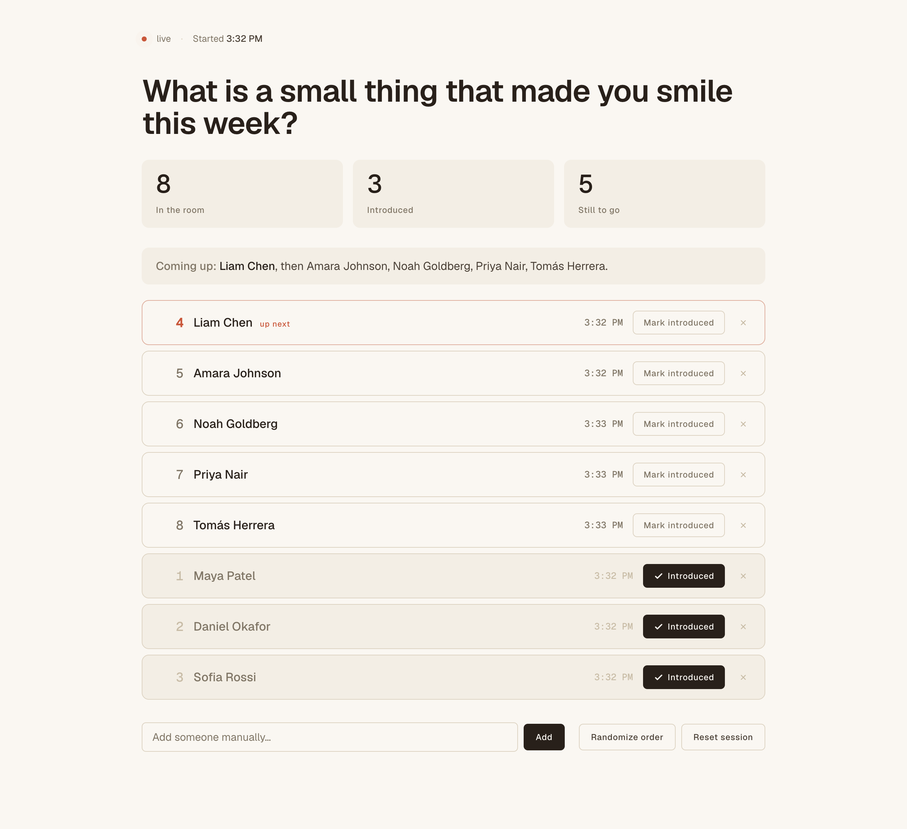

# Icebreaker Tracker

> A live roster of who has introduced themselves — for meetings where
> everyone goes around the room.

In meetings where everyone introduces themselves, somebody always asks
*"wait, has Alex gone yet?"* and the room loses thirty seconds. Icebreaker
Tracker puts the answer on screen for everyone: a live roster, who has been
marked introduced, and who is coming up next.

Screen-share the page so the whole room can self-pace. It reads Zoom's
Participants panel automatically on macOS and Windows, or you type names in
by hand — the page looks and works the same either way.

One local process, one command. No Node, no Zoom account, no credentials,
and nothing leaves your machine.

<p align="center">
  <video src="docs/demo.webm" width="820" autoplay loop muted playsinline
         poster="docs/screenshot-desktop.png">
    
  </video>
</p>

<p align="center">
  <em>No meeting handy? The first screen has a <strong>Try a demo</strong> button that
  loads this sample roster so you can click around. Leaving demo mode clears the slate.</em>
</p>

## Two ways to run it

- **In the browser, no install** —
  **<https://rlorenzo.github.io/zoom-icebreaker/>**. The same page, running
  entirely client-side: add names by hand, mark people introduced, reorder, set
  a prompt, screen-share the tab. Your session is kept in the browser
  (localStorage) so a refresh mid-meeting doesn't lose the slate, and nothing is
  sent anywhere. The only thing it can't do is read Zoom's panel for you (that
  needs OS accessibility access) — so it's manual entry, and everything else is
  identical.
- **Locally, with automatic Zoom reading** — one Python command, below. Adds
  auto-filling the roster from Zoom's Participants panel on macOS and Windows.

## Quick start (local app)

```bash
uv sync          # one-time: install dependencies
uv run tracker.py
```

Open <http://localhost:3000> and screen-share that browser tab in Zoom.
That's the whole setup — names start filling in (or add them yourself), and
you tap one button per person as they speak.

> Don't have `uv`? It's a single-binary Python installer — see the
> [uv install guide](https://docs.astral.sh/uv/getting-started/installation/).
> Or skip it entirely and use the [hosted
> version](https://rlorenzo.github.io/zoom-icebreaker/).

## What you get

- **A live roster** that updates for everyone watching the share, no refresh.
- **One-tap "introduced"** per person. The counts and the highlighted "up
  next" row update instantly.
- **Automatic Zoom reading** on macOS and Windows — it fills the roster from
  the Participants panel so you rarely type a name. Keep that panel **open**:
  it is what the tracker reads, and with it closed the roster simply stays
  empty rather than guessing at whatever else is on screen.
- **Manual mode anywhere** — no permission or wrong OS? Type names in. The
  page is identical.
- **A prompt and the order you want** — set an icebreaker prompt at the top of
  the page, drag a still-to-go row (or focus it and press ↑/↓) to move someone,
  or hit **Randomize order**. People who have already gone keep their number.
- **Four themes** — Clear sky (the default), Dawn, Golden hour, and After
  dark, picked from the row below the roster. Your choice is remembered in
  this browser (localStorage) for next time.
- **Private by design** — no account, no history, and nothing sent anywhere.
  In the local app, state lives only in memory and is gone when you stop the
  process; the hosted version keeps it in your browser (localStorage) so a
  refresh doesn't lose the meeting, and clearing it is a click away.

## Two views, one screen

The host and the room see the same page, and both matter:

- **The host** runs the command, opens the page, and screen-shares it. They
  are the only person who clicks anything — toggling "introduced" as each
  person speaks, occasionally adding a name, hitting reset at the end.
- **The room** watches over screen-share. They can't interact; they read.
  They want to know who has gone, who hasn't, and whether they're up next —
  on compressed video, often on a laptop, sometimes on a phone.

So the layout stays legible on a shared screen and reflows cleanly down to
phone width. The "introduced" toggle is always manual, by design: it's a
judgement call only the host can make as people actually speak.

You can always mix modes — let it auto-read and still add or remove people
by hand.

## Auto-reading Zoom

Auto-read watches your screen's accessibility tree to list who is in the
Participants panel. It never talks to Zoom's API or SDK, so it doesn't touch
Zoom's terms — but it can break when Zoom redesigns the panel (see
[troubleshooting](#troubleshooting)).

### macOS

Auto-read needs `pyobjc` (installed by `uv sync`) and macOS Accessibility
permission. Grant permission to the app you run the command *from* (Terminal
or iTerm) in **System Settings → Privacy & Security → Accessibility**, then
reopen that terminal.

Start your meeting, open the Participants panel, then run `uv run
tracker.py`.

### Windows

Auto-read uses [UI Automation](https://learn.microsoft.com/en-us/windows/win32/winauto/entry-uiauto-win32)
via the `uiautomation` package (also installed by `uv sync`). No extra
permission prompt — UIA is part of the standard Windows accessibility stack.

Start your meeting, open the Participants panel, then run `uv run
tracker.py`. The `--anchor-regex`, `--exclude`, and `--debug` flags below
work the same as on macOS; `--bundle` is macOS-only and ignored here.

## Running a meeting

1. `uv run tracker.py`, open the URL, and share that tab in Zoom.
2. People appear automatically (or add them manually). "Started" shows when
   you began the session.
3. Tap **Mark introduced** after each person speaks. The counts and the
   highlighted "up next" row update live for everyone watching.
4. **Reset session** clears it for the next meeting.

## Command-line options

```text
--port N          port to serve on (default 3000)
--interval N      seconds between Zoom reads (default 5)
--no-ax           manual entry only, never read Zoom
--anchor-regex    text identifying the participants container
--exclude "a,b"   extra whole-word non-name terms to filter out
--min-len N       minimum name length (default 2)
--bundle ID       macOS Zoom bundle id (default us.zoom.xos); ignored elsewhere
--debug           print anchor / raw-node diagnostics
```

## Troubleshooting

Zoom's accessibility tree is undocumented and changes between versions. If
names don't appear, see what Zoom is exposing and tune the matcher:

```bash
uv run ax_dump.py --grep '(?i)participant'   # macOS only
uv run tracker.py --anchor-regex 'participants|attendees' --debug
```

`ax_dump.py` reads the macOS AX tree, so it is macOS-only; on Windows use
`tracker.py --debug`, which prints the same anchor and raw-node diagnostics
from the UIA side.

Known limitations:

- Virtualized participant lists may only expose names currently scrolled
  into view.
- Dial-in users sometimes appear as phone numbers rather than names.
- It reads who is *present*, not who has *spoken*. Marking someone introduced
  is always the host's call, by design — there is no automatic detection of
  who has actually taken their turn.

## Development

```bash
uv sync --dev                # Python dev tools
npm ci                       # web dev tools (vitest, biome, playwright)
uv run pre-commit install --hook-type pre-commit --hook-type pre-push
uv run pre-commit run --all  # every commit-stage hook once
```

Running the suites directly:

```bash
uv run pytest                # Python: HTTP handler, session state, name filtering
npm test                     # web: unit + jsdom integration (vitest)
npm run coverage             # same, plus the coverage report fallow reads
```

Tooling: ruff (lint + format), mypy (strict), bandit and gitleaks (security),
lizard (complexity), pylint (duplicate code), pymarkdown (markdown), and
pip-audit / npm audit for dependency CVEs — plus biome, html-validate, and
fallow for the web assets. The slower gates (pip-audit, fallow, vitest) are
staged on pre-push rather than on every commit, so `pre-commit run --all`
skips them; CI runs the whole set on every PR via
[`.github/workflows/ci.yml`](.github/workflows/ci.yml).

The web assets (`index.html`, `app.js`, `roster.js`, `demo.js`, `engine.js`,
`session.js`, `styles.css`, and the two self-hosted faces in `fonts/`) are read
into memory once at startup, so the server never opens a file in response to a
request. The trade-off: editing any of them requires restarting the server
(Ctrl-C and re-run) to see the change.

The same assets are deployed to GitHub Pages by
[`.github/workflows/pages.yml`](.github/workflows/pages.yml) on every push to
`main`. There, `app.js` finds no `/events` backend and falls back to the local
in-browser engine (`engine.js`); `tracker.py` is not involved at all.

The README clip (`docs/demo.webm`, VP9) is generated from demo mode, so it
never needs a real meeting. With the server running, Playwright installed
(`npx playwright install chromium`), and an ffmpeg with libvpx-vp9 on `PATH`
(`brew install ffmpeg`, or point `$FFMPEG` at one), regenerate it with
`npm run record:demo`.

## Support

If this saved your meeting a few awkward seconds, you can
[sponsor the project on GitHub](https://github.com/sponsors/rlorenzo).
